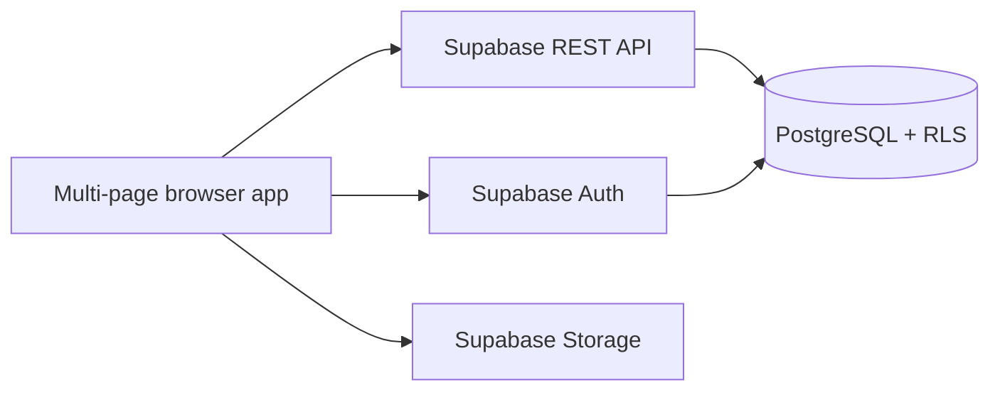
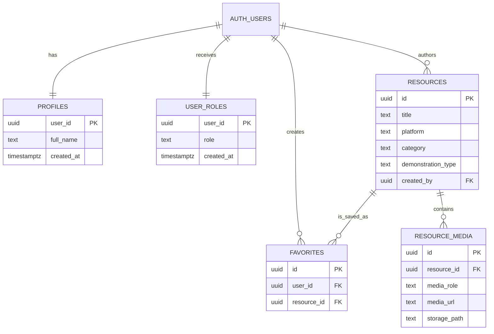

# Kami's Gamified English Resources

A responsive multi-page English teaching platform created by Kameliya Boshlova. It combines a curated catalogue of Kahoot and Wordwall activities with teaching demonstrations, Supabase authentication, favorites, role-based administration and file storage.

## Main functionality

### Visitors

- Browse the public resource catalogue and filter it by platform, level and skill.
- Open individual resource pages and launch external Kahoot or Wordwall activities.
- View the author's teaching demonstration and clearly labelled external examples.
- Register or sign in.

### Registered learners

- View their account and role on **My Profile**.
- Add database resources to **My Favorite Resources**.
- Remove their own favorites.
- Sign out from every public screen.

### Administrators

- Access the protected admin panel.
- Add, edit and delete learning resources.
- Attach external media or upload one file, multiple files or a whole folder.
- Download and delete uploaded files.
- Classify records as personal teaching demonstrations or external teaching examples.

Authorization is enforced in Supabase with Row-Level Security. Hiding an admin link in the browser is not used as the security boundary.

## Technology stack

- HTML5 and semantic multi-page navigation
- CSS3 and Bootstrap 5
- Vanilla JavaScript ES modules
- Node.js, npm and Vite
- Supabase PostgreSQL, Auth, REST API and Storage
- Netlify deployment configuration
- Git and GitHub

## Architecture

The browser loads a separate HTML document for every screen. Page modules communicate directly with Supabase through the shared client in `src/supabase.js`. Supabase Auth issues JWT access tokens; PostgreSQL RLS policies use the authenticated user ID and the `user_roles` table to authorize every database operation.



## Database schema



The reproducible schema, indexes, trigger, RLS policies and Storage policies are stored in `supabase/migrations/`.

## Screens

- `index.html` — home, featured resources, libraries and project description
- `resources.html` — full catalogue and filters
- `resource-details.html` — database resource details and favorite action
- ten curated static resource detail pages
- `teaching-demonstration.html` — author's teaching demonstration
- `external-teaching-examples.html` — external example with attribution
- `how-to-use.html` — usage guidance
- `login.html` — sign in
- `register.html` — learner registration
- `profile.html` — account, role and favorites
- `admin.html` — protected resource and media management

## Important folders and files

```text
.
├── .github/copilot-instructions.md   # AI agent project rules
├── public/                           # files copied directly to production
├── src/
│   ├── assets/                       # local images
│   ├── auth-nav.js                   # shared session-aware navigation
│   ├── supabase.js                   # shared Supabase client
│   ├── admin.js                      # admin CRUD and Storage operations
│   ├── resources.js                  # catalogue loading and filtering
│   ├── resource-details.js           # details and favorites
│   ├── login.js / register.js        # authentication
│   ├── profile.js                    # learner account and favorites
│   └── style.css                     # Bootstrap import and custom design
├── supabase/migrations/              # database, RLS and Storage SQL
├── vite.config.js                    # all root HTML pages as build entries
├── netlify.toml                      # build and deployment settings
└── .env.example                      # required environment variable names
```

## Local development

Prerequisites: Node.js 22 and npm.

```bash
git clone https://github.com/KamiBosh2025/kamis-gamified-english-resources.git
cd kamis-gamified-english-resources
npm install
```

Copy `.env.example` to `.env` and insert the Supabase project URL and publishable key:

```env
VITE_SUPABASE_URL=https://your-project.supabase.co
VITE_SUPABASE_PUBLISHABLE_KEY=your-publishable-anon-key
```

Never commit `.env` or a Supabase service-role key.

Start the development server:

```bash
npm run dev
```

Create and verify the production output:

```bash
npm run build
npm run preview
```

## Database setup

For a new Supabase project, run the migration from `supabase/migrations/` through the Supabase CLI or SQL Editor. The migration creates the five public tables, relationships, indexes, registration trigger, RLS policies and the `resource-media` bucket policies.

New registrations automatically receive the `normal` role. Promote only the site owner to `admin` from a trusted Supabase SQL session; never allow public users to choose their own role.

## Deployment

The repository includes `netlify.toml`. In Netlify:

1. Import the GitHub repository.
2. Keep build command `npm run build` and publish directory `dist`.
3. Add `VITE_SUPABASE_URL` and `VITE_SUPABASE_PUBLISHABLE_KEY` as environment variables.
4. Deploy and test every page, both roles and an uploaded file.
5. Add the final live URL and real demonstration credentials below.

## Submission information

- **Author:** Kameliya Mironova Boshlova
- **GitHub repository:** https://github.com/KamiBosh2025/kamis-gamified-english-resources
- **Live project URL:** add after the final Netlify deployment
- **Normal-user sample credentials:** add after creating the final demo account
- **Administrator sample credentials:** provide privately in the SoftUni submission form

## Security notes

- The frontend uses only the public Supabase publishable key.
- Admin routes check the current session and role.
- Database and Storage writes are protected by RLS policies.
- Users can read their own role and profile and manage only their own favorites.
- Admin rights are assigned only through a trusted database operation.

## License and educational content

The website and original descriptions are © 2026 Kameliya Boshlova. Kahoot, Wordwall, Google Drive and YouTube content remains subject to the respective platform and creator terms.
